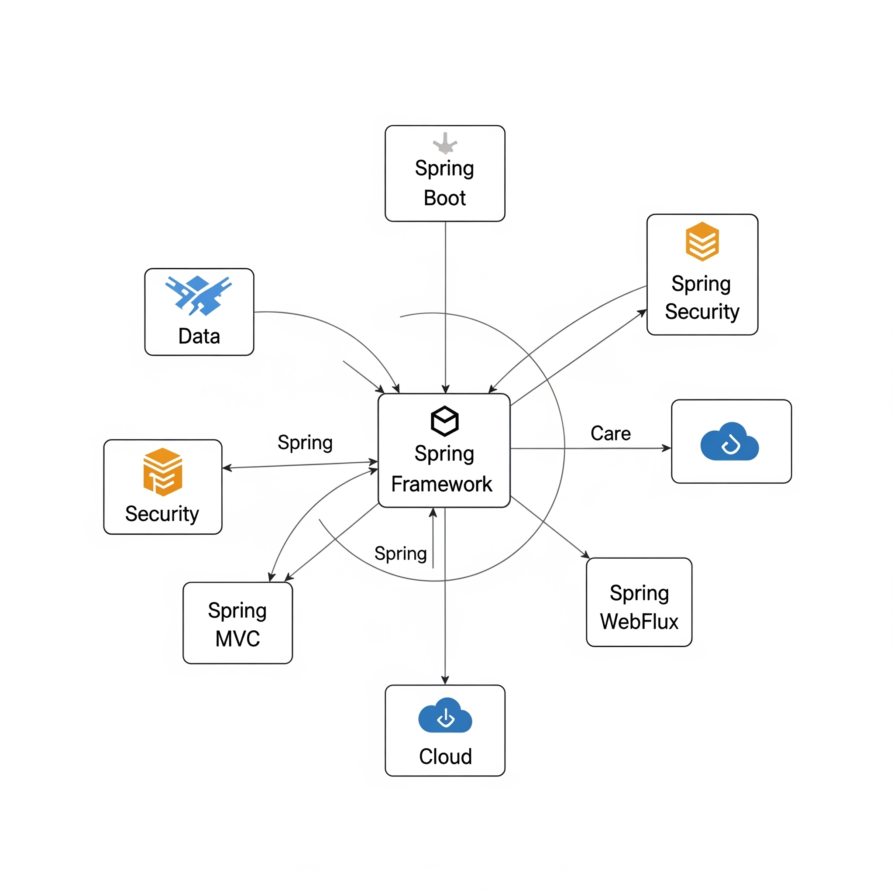

# 用于方便查看回顾
# http://securitytech.cc/ 的免费文本教程

# [官网](securitytech.cc) 会长期更新工具、产品开发、产品开发教程、商业产品开发。视频教程。

# [本人介绍](http://securitytech.cc/about)

---

## Java 全栈开发简介：生态与主流技术栈

在软件开发领域，“全栈”意味着开发者能够独立处理应用程序的**前端（用户界面）**、**后端（服务器逻辑、数据库交互）**和**部署运维**。Java 作为一门成熟、稳定且功能强大的编程语言，同样拥有完善的全栈开发能力。

---

### 一、Java 全栈开发概览

Java 全栈开发利用 Java 语言及其庞大的生态系统来构建从用户界面到后端服务，再到数据库存储的整个应用程序。它通常涉及以下几个核心部分：

* **前端（Web/桌面/移动）**：负责用户可见的界面和交互。虽然 Java 不直接编写浏览器端的 JavaScript/HTML/CSS，但可以通过特定的框架和技术栈（如后端渲染、WebAssembly、混合应用）来间接或直接地参与前端开发。
* **后端（服务器端）**：核心业务逻辑、数据处理、API 接口提供、与数据库交互等。这是 Java 的传统强项。
* **数据库**：数据的存储、检索和管理。
* **部署与运维**：将应用程序部署到服务器，并进行监控、扩展和维护。

---

### 二、Java 生态系统核心优势

Java 语言和生态系统之所以能够支撑全栈开发，得益于其以下优势：

1.  **成熟与稳定**：Java 诞生于 1995 年，经过近 30 年的发展，拥有极其成熟的规范、工具和最佳实践。
2.  **跨平台性**：得益于 Java 虚拟机（JVM），Java 应用程序可以“一次编写，到处运行”，无需修改代码即可在不同操作系统上运行。
3.  **强大的性能**：JVM 经过高度优化，JIT（Just-In-Time）编译器能提供卓越的运行时性能。
4.  **庞大的社区与生态**：拥有全球最大的开发者社区之一，这意味着丰富的开源库、框架、工具和解决方案。
5.  **企业级支持**：在大型企业级应用开发中占据主导地位，提供了强大的安全性、可伸缩性和可维护性。
6.  **工具链完善**：拥有 IntelliJ IDEA、Eclipse 等强大的 IDE，以及 Maven、Gradle 等成熟的构建工具。

---

### 三、Java 全栈主流技术栈

Java 全栈开发的选择非常多，以下是构建现代 Java 全栈应用时常见的技术栈组合：

#### 1. 后端技术栈 (Java 的核心优势领域)

* **核心语言与平台**：
    * **Java (JDK)**：最新 LTS 版本 (如 Java 17, Java 21) 是主流选择。
* **Web 框架**：
  
  

    * **Spring Framework / Spring Boot**：毫无疑问，这是 Java 后端开发的**事实标准**。Spring Boot 简化了 Spring 应用的搭建和部署，提供了“开箱即用”的体验。它包括：
        * **Spring MVC**：用于构建 RESTful API 和 Web 应用程序。
        * **Spring Data JPA**：简化数据库访问（ORM）。
        * **Spring Security**：提供强大的认证和授权功能。
        * **Spring Cloud**：用于构建微服务架构。
    * **Quarkus**：为云原生和微服务优化，启动速度快、内存占用低，非常适合容器化部署。
    * **Micronaut**：另一个轻量级、高性能的微服务框架。
    * **Vert.x**：基于事件驱动和非阻塞 I/O，适合构建高并发、响应式服务。
* **构建工具**：
    * **Maven**：历史悠久，配置规范，依赖管理强大。
    * **Gradle**：更灵活、更现代化，性能通常优于 Maven。

#### 2. 数据库

* **关系型数据库**：
    * **MySQL**：广泛应用，社区版免费，性能良好。
    * **PostgreSQL**：功能强大，兼容性好，支持 JSONB 等高级特性，更适合复杂应用。
    * **Oracle Database**：企业级应用的首选，功能全面但通常需要商业许可。
    * **SQL Server**：微软的数据库，在 Windows 环境中常用。
* **NoSQL 数据库**：
    * **MongoDB**：文档型数据库，灵活的数据模型，适合大数据和快速迭代。
    * **Redis**：键值存储，高性能缓存、消息队列和会话管理。
    * **Cassandra**：分布式 NoSQL 数据库，高可用性和可伸缩性。

#### 3. 前端技术栈 (与 Java 后端配合)

虽然 Java 很少直接用于浏览器端 UI，但它可以通过多种方式与前端技术结合：

* **主流 JavaScript 框架 (最常见)**：
    * **React / Angular / Vue.js**：这些是当前最流行的前端框架。Java 后端通过提供 **RESTful API 或 GraphQL API** 与它们进行通信。这种模式被称为“**前后端分离**”。
* **服务器端渲染 (SSR)**：
    * **Thymeleaf / JSP / FreeMarker**：传统的 Java Web 模板引擎，后端渲染 HTML 页面并发送给浏览器。这种模式在某些遗留系统或对 SEO、首屏加载有严格要求的应用中仍在使用。
* **WebAssembly (WASM)**：
    * **Blazor (via Blazor Hybrid)**：虽然 Blazor 主要是 C# 技术，但 .NET 和 Java 在 JVM 生态中有一些相似之处。Blazor Hybrid 可以构建桌面应用，它使用 Blazor UI（Web技术）宿主在原生框架中。Java 也有将代码编译成 WebAssembly 的实验性项目，但目前不成熟。
    * **Vaadin**：一个全栈 Web 框架，允许你用 Java 编写整个 Web 应用（包括 UI），它在浏览器中利用 Web 组件。对于不想写 JavaScript 的 Java 开发者有吸引力。
* **桌面 GUI 框架**：
    * **JavaFX**：现代的 Java 桌面 GUI 框架，功能强大，支持 CSS 样式和 FXML 标记语言。
    * **Swing / AWT**：传统的 Java 桌面 GUI 库，但现在较少用于新项目。
* **移动应用**：
    * **Android 原生开发**：Android 应用程序主要使用 Java (或 Kotlin) 和 XML 来构建。
    * **跨平台框架**：例如 React Native (JavaScript), Flutter (Dart) 等，这些框架通常通过 API 与 Java 后端通信。

#### 4. 部署与 DevOps

* **容器化**：
    * **Docker**：将应用程序及其所有依赖项打包成一个独立的、可移植的容器，实现环境一致性。
* **容器编排**：
    * **Kubernetes (K8s)**：用于自动化部署、扩展和管理容器化应用程序。
* **持续集成/持续部署 (CI/CD)**：
    * **Jenkins / GitLab CI/CD / GitHub Actions**：自动化代码构建、测试和部署流程。
* **云平台**：
    * **AWS / Azure / Google Cloud Platform**：提供计算、存储、数据库、网络等基础设施和平台服务。
* **监控**：
    * **Prometheus & Grafana / ELK Stack**：用于收集、存储、分析和可视化应用及系统日志和指标。

---

### 四、构建一个典型的 Java 全栈应用

一个现代的 Java 全栈应用通常会采用以下架构：

1.  **前端 (React/Vue/Angular)**：通过构建工具 (Vite/Webpack) 打包成静态文件。
2.  **Nginx/CDN**：负责托管前端静态文件，并作为反向代理将 API 请求转发给后端。
3.  **Java 后端 (Spring Boot)**：提供 RESTful API，处理业务逻辑，与数据库交互。部署为 Docker 容器。
4.  **数据库 (PostgreSQL/MySQL)**：存储应用数据。
5.  **Docker & Kubernetes**：容器化部署和管理后端服务，实现高可用和弹性伸缩。
6.  **CI/CD 流水线**：自动化整个开发和部署流程。

---

### 五、总结

Java 全栈开发凭借其成熟的生态、强大的后端能力以及与各种前端技术灵活集成的能力，依然是企业级应用开发的首选。无论是构建传统的单体应用，还是现代的微服务架构，Java 都能提供一套完整且可靠的解决方案。

 